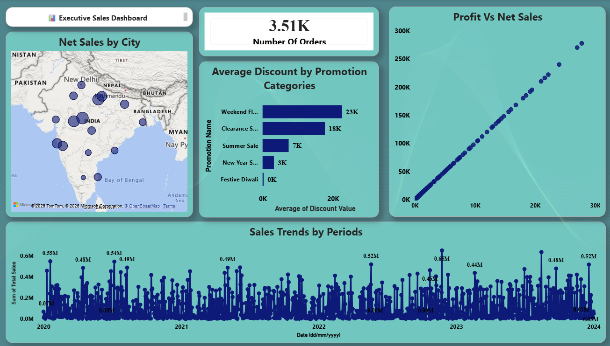
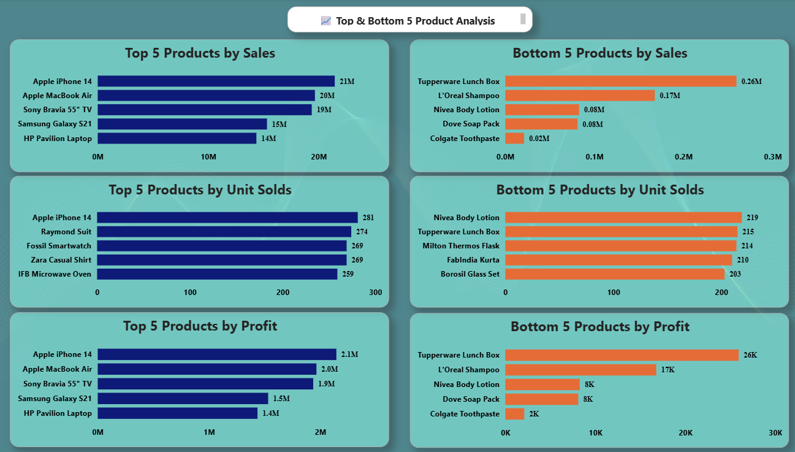
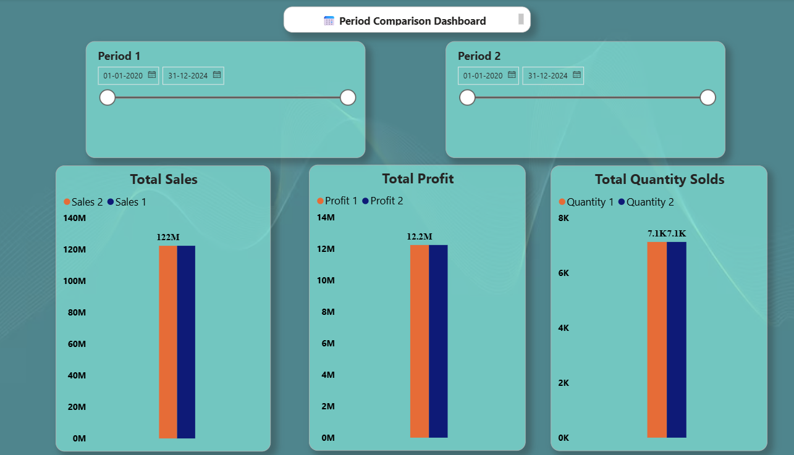
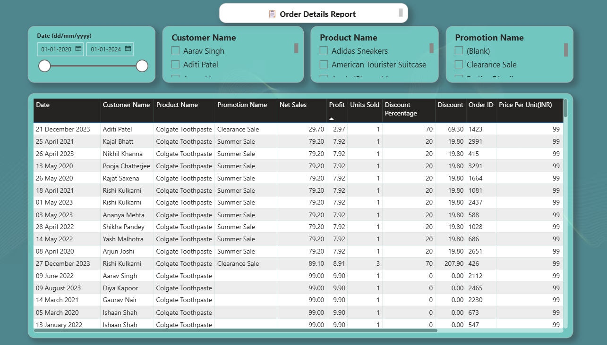

# 📊 Sales Data Analysis Dashboard | Power BI

## 📌 Project Overview

This project presents an interactive Sales Data Analysis Dashboard developed using Microsoft Power BI.

The dashboard enables users to analyze sales performance, identify top and bottom performing products, compare custom time periods, monitor sales trends, and explore detailed order-level information.

---

## 🛠 Tools & Technologies

- Microsoft Power BI
- Power Query
- DAX
- Data Modeling
- Microsoft Excel

---

## 📊 Dashboard Pages

- Executive Sales Dashboard
- Top & Bottom 5 Product Analysis
- Period Comparison Dashboard
- Order Details Report

---

## ✨ Features

- Interactive Dashboard
- Dynamic Filters & Slicers
- Sales Trend Analysis
- Product Performance Analysis
- City-wise Sales Analysis
- Period Comparison using DAX
- Detailed Order Report

---

## 📸 Dashboard Screenshots

### Executive Dashboard



### Top & Bottom Product Analysis



### Period Comparison Dashboard



### Order Details Report



---

## 📁 Repository Structure

```text
Dashboard/
Images/
README.md
```

---

## 👨‍💻 Author

**Sujal Gupta**
